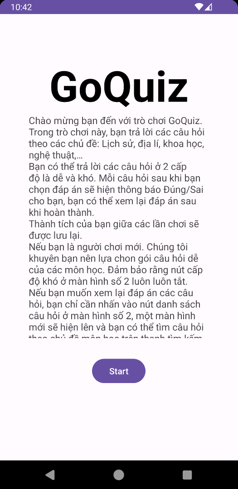
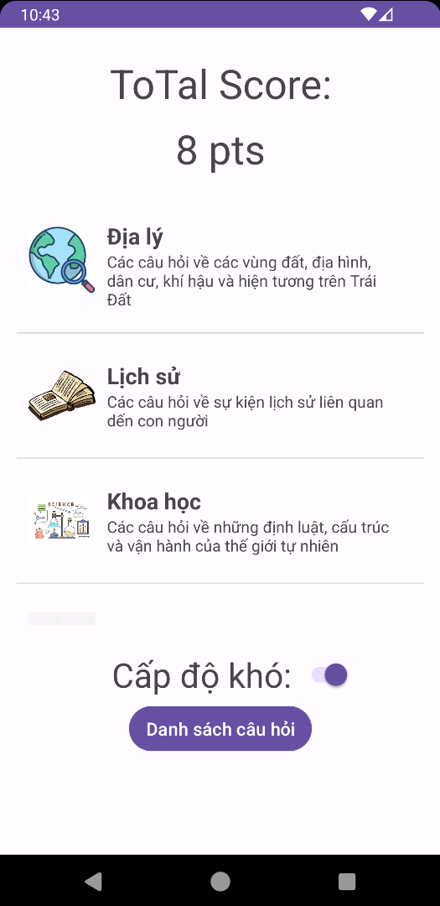
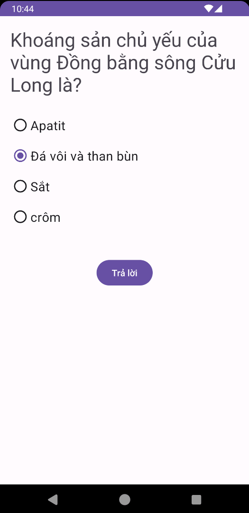
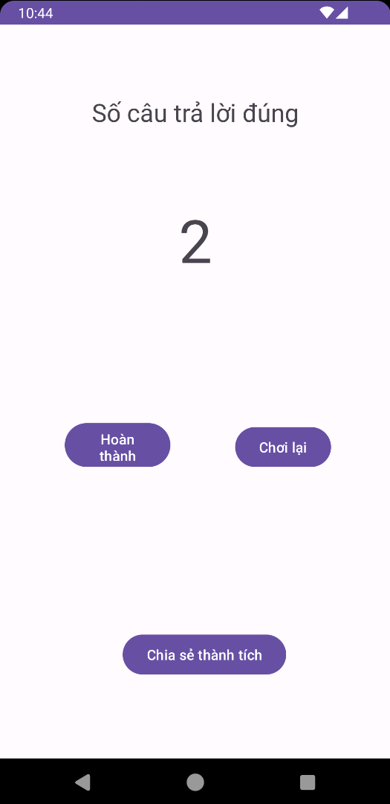
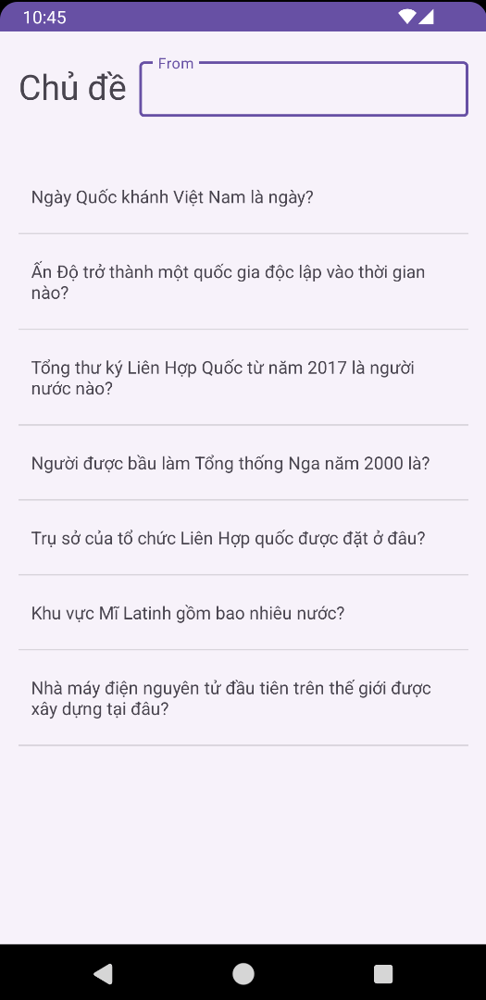
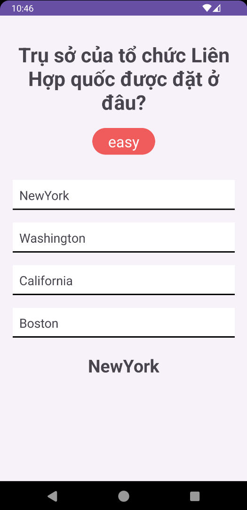
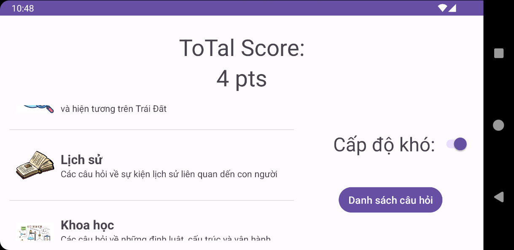
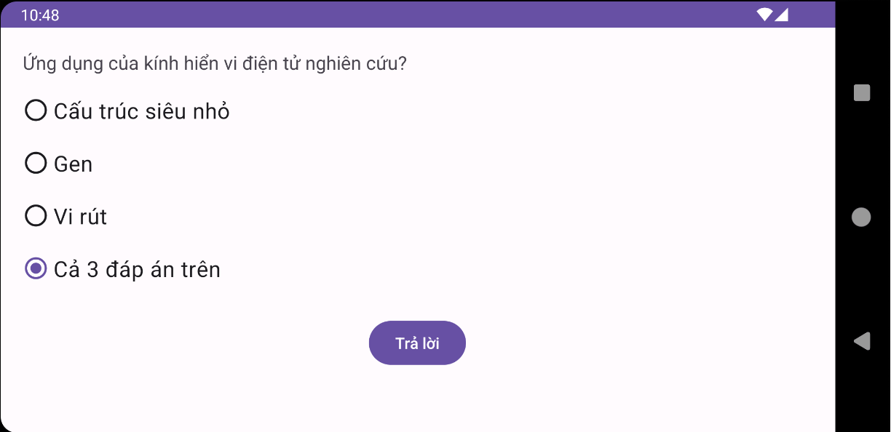
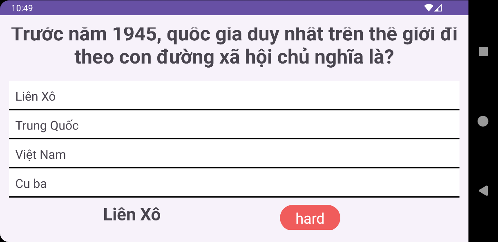

# **Giới thiệu Ứng dụng**
GoQuiz là ứng dụng Android được viết bằng Java, giúp người dùng giải trí qua các câu hỏi chủ đề như Địa lý, Khoa học, Lịch sử, Toán. Ứng dụng có hai chế độ chơi: Dễ và Khó, cho phép người chơi lựa chọn mức độ. Điểm số được tính dựa trên độ khó của chế độ – một điểm cho chế độ Dễ và hai điểm cho chế độ Khó. Điểm của người chơi được theo dõi và lưu lại. Ngoài ra, danh sách đầy đủ các câu hỏi, câu trả lời và đáp án đúng được cung cấp để xem lại vào cuối mỗi phiên chơi.

## **Phân công thành viên trong nhóm**

### **Nguyễn Ngọc Dũng (Trưởng Nhóm)**
- Thiết kế và lập trình frame 2, 3, bao gồm ListView cho các môn học. Khi chọn một mục từ danh sách, câu hỏi tương ứng sẽ hiển thị trong frame 3.
- Phát triển hai chế độ chơi Dễ và Khó.
- Tạo một tệp tin tổng hợp gồm câu hỏi, câu trả lời trắc nghiệm, và đáp án đúng, sử dụng cho frame 2, 3, 5, và 6.
- Thiết kế giao diện màn hình ngang của ứng dụng.

### **Phạm Đình Quân**
- Thiết kế và lập trình frame 5 và 6.
- Sử dụng tệp câu hỏi để hiển thị danh sách tất cả câu hỏi ở frame 5, tích hợp menu lọc câu hỏi theo từng chủ đề.
- Chi tiết từng câu hỏi trong frame 6, hiển thị 4 câu trả lời, đáp án đúng và độ khó.
- Phát triển và thiết kế frame 1, thiết lập giao diện người dùng ban đầu.

### **Trịnh Tuấn Anh**
- Thiết kế và lập trình frame 4.
- Hiển thị số câu trả lời đúng từ frame 3 lên frame 4.
- Lập trình các nút hoàn thành, chơi lại, và chia sẻ kết quả sang các ứng dụng khác.
- Tính và hiển thị tổng điểm cho lần chơi gần nhất trên frame 2.
- Tổng hợp và sắp xếp cơ sở dữ liệu câu hỏi.

## **Hình Ảnh Ứng dụng**

### Màn hình dọc:
<table>
  <tr>
    <td></td>
    <td></td>
    <td></td>
    <td></td>
    <td></td>
    <td></td>
  </tr>
</table>

### Màn hình ngang:
  
